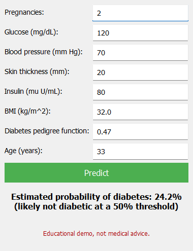

# Diabetes Predictor

Logistic regression written from scratch in NumPy, trained on the Pima Indians Diabetes dataset, with a small PyQt5 desktop form that shows the predicted probability.



[](LICENSE)

## Overview

- Course project for Artificial Intelligence, Shiraz University, July 2023.
- Authors: Matin Monshizadeh and [AmirHossein Roodaki](https://github.com/Roodaki).
- Dataset: Pima Indians Diabetes Database, 768 rows, 8 numeric features, binary `Outcome`.
- The assignment required implementing logistic regression without a library. scikit-learn is used only for the train/test split, the metrics and a sanity-check comparison.

## The model

`model.py` implements binary logistic regression with no machine-learning library:

- Features are standardised (zero mean, unit variance) with statistics computed on the training split only.
- Prediction is `sigmoid(X @ w + b)`, using a numerically stable sigmoid.
- The loss is the mean binary cross-entropy.
- Training is full-batch gradient descent: `dw = X.T @ (p - y) / n`, `db = mean(p - y)`, 3000 steps at learning rate 0.1, with a fixed random seed.
- `predict_proba` returns probabilities; `predict` applies a 0.5 threshold.

## Results

Stratified 80/20 split (seed 42), 614 training rows and 154 test rows. Both models are trained on the same standardised features.

| Metric    | Ours  | scikit-learn |
|-----------|-------|--------------|
| Accuracy  | 0.714 | 0.714        |
| Precision | 0.609 | 0.609        |
| Recall    | 0.519 | 0.519        |
| ROC-AUC   | 0.824 | 0.823        |

The learned weights agree with scikit-learn to about two decimal places (see the output of `train.py`). Glucose and BMI carry the largest positive weights.

## Usage

```bash
git clone https://github.com/matinmonshizadeh/diabetes-predictor.git
cd diabetes-predictor
pip install -r requirements.txt
python train.py   # trains, prints the comparison table, writes models/
python app.py     # opens the form
```

`train.py` is deterministic and takes a few seconds. `app.py` loads `models/diabetes_lr.json`, validates the eight inputs, and shows the estimated probability of diabetes.

## Project structure

```
data/diabetes.csv        dataset (768 rows)
model.py                 from-scratch logistic regression and scaler
train.py                 training, evaluation, sklearn comparison, saves models/
app.py                   PyQt5 form that loads the saved model
models/diabetes_lr.json  weights, bias and scaler statistics
models/metrics.json      test-set metrics for both models
docs/app.png             screenshot
```

## Limitations

- Tiny dataset (768 rows from one population), so the metrics have wide error bars and the model will not transfer to other groups.
- Educational demo, not medical advice. It must not be used to diagnose anyone.
- Probabilities are not calibrated and the 0.5 threshold was not tuned.
- The dataset encodes missing values as 0 (for example Glucose or BMI of 0); this project does not impute them.

## Licence and credits

Code is released under the [MIT License](LICENSE), copyright 2023 Matin Monshizadeh and AmirHossein Roodaki.

The dataset is the Pima Indians Diabetes Database, originally from the National Institute of Diabetes and Digestive and Kidney Diseases (Smith, J. W. et al., 1988, *Using the ADAP learning algorithm to forecast the onset of diabetes mellitus*, Proc. Symp. Computer Applications and Medical Care, 261 to 265). `data/diabetes.csv` is the copy distributed on Kaggle as [uciml/pima-indians-diabetes-database](https://www.kaggle.com/datasets/uciml/pima-indians-diabetes-database) under the CC0 1.0 Public Domain licence, and is byte-identical to the mirrors in the `plotly/datasets` and `jbrownlee/Datasets` GitHub repositories.
